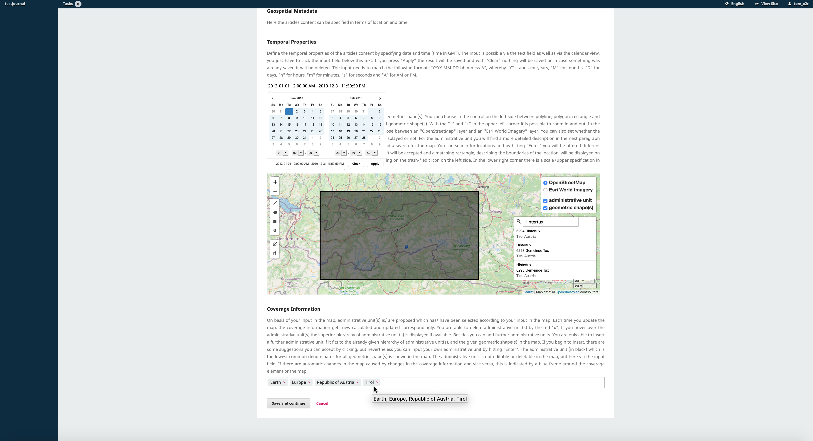
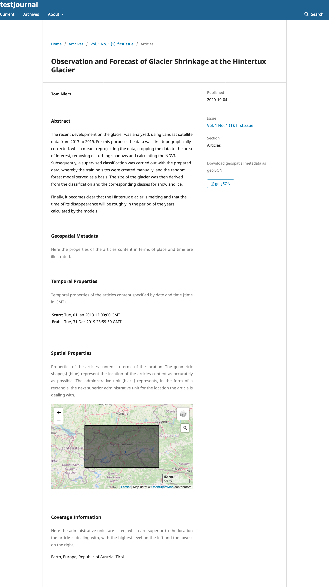

<div>
<a href="https://projects.tib.eu/optimeta/en/">

</a>
<a href="https://projects.tib.eu/komet/en/">

</a>
</div>

# geoMetadata Plugin
[](https://www.repostatus.org/#wip) [](https://doi.org/10.5281/zenodo.8198983)

The geoMetadata Plugin (formerly known as OJS Geo Plugin or OPTIMETA Geo Plugin) offers a novel way to capture and provide geospatial properties of research articles in [Open Journal Systems (OJS)](https://pkp.sfu.ca/ojs/).
It is developed as part of the BMFTR-funded projects [OPTIMETA](https://projects.tib.eu/optimeta/en/) and [KOMET](https://projects.tib.eu/komet/en/).

The KOMET team develops further plugins like the [citationManager](https://github.com/TIBHannover/citationManager) and [pidManager](https://github.com/TIBHannover/pidManager). 
Visit the [KOMET project website](https://projects.tib.eu/komet/output/) for a full overview of the project output.

## Functionality  
Authors can either search for a location and accept the suggested bounding box or manually create one or more suitable geometric shape(s) on a map.
If authors enter geometries, a gazetteer is used to suggest a matching administrative unit’s name to the author.
This allows the plugin to store geospatial data in two forms: as text, using an administrative unit or standardised geographical norm data, and as geospatial coordinates in GeoJSON format.
Thereby the coordinates are stored accurately, while at the same time a textual description is accessible and flexible for non-map-related usage.
Authors can also choose to specify the temporal range within which the research was conducted.
In the article view, the properties specified by the author are then displayed and available for download as geoJSON.
In addition, the information is also added to the HTML source code of article’s landing pages in a semantically meaningful way.

<div style="text-align:center">

<br/>
<em>Screenshot of entering geospatial properties in the OJS submission process</em>
</div>

<div style="text-align:center">

<br/>
<em>Screenshot of geospatial properties in the OJS article view</em>
</div>

## Publications 
- A first prototype of the geoMetadata Plugin was developed under the name *geoOJS* by Tom Niers for the BSc. thesis [Geospatial Metadata for Discovery in Scholarly Publishing](http://nbn-resolving.de/urn:nbn:de:hbz:6-69029469735); the work was [presented at The Munin Conference on Scholarly Publishing, 2020](https://doi.org/10.7557/5.5590), see [recording](https://youtu.be/-Lc9AjHq_AY).

## Download & Installation
You can download OJS via the [PKP Software Download Section](https://pkp.sfu.ca/software/ojs/download/). 
A detailed [GetStarted Guide](GetStarted.md) for installing OJS is available. 

### From Source
Once OJS has been installed, the plugin must be downloaded and installed.

1. Clone [the code repository](https://github.com/TIBHannover/geoMetadata/) and save the contents into the directory `ojs/plugins/generic/geoMetadata` in your OJS installation.
1. Checkout the desired OJS version of the geoMetadata code repository by selecting the corresponding branch e.g. `stable-3_3_0`.
1. Run `composer install` in `ojs/plugins/generic/geoMetadata` to download JavaScript dependencies for the plugin using [Asset Packagist](https://asset-packagist.org/site/about).
1. Activate the plugin in the OJS plugin settings (OJS > Dashboard > Website > Plugins > Installed Plugins) and continue with [Configuration](#configuration).

### Via Release
See releases at <https://github.com/TIBHannover/geoMetadata/releases>. The release bundles contain plugin source code as well as the required JavaScript.

1. Download the source code, you will find the source code in the assets of the corresponding release. The following two options are available. You must select one of them:
   1. Manual installation via folder placement 
      - Download the source code as `zip-archive` or `tar.gz-archive` and uncompress it.
      - Save the contents into the directory `ojs/plugins/generic/geoMetadata` in your OJS installation. It is important to store the content in the directory `ojs/plugins/generic/geoMetadata` and not in a directory including the tag e.g. `ojs/plugins/generic/geoMetadata-1.0.0.0-beta`. 
   1. Installation via upload 
      - Download the source code as `zip-archive` or `tar.gz-archive`. Renaming is not required.
      - Prerequisites 
         - The upload limit in OJS is 2 MB by default. To upload the GeoMetadata plugin, you need to increase this limit in the used `php.ini`-file.
            - If you do not know where the `php.ini` file is located, you can find it by creating an `info.php`-file in your server folder containing the following content: `echo "<?php phpinfo();" >`
               - Open the `info.php`-file in a browser to check the location (property: `Loaded Configuration File`) of the `php.ini`-file.
            - The following properties need to be adapted: 
               - `post_max_size = 100M`
               - `upload_max_filesize = 100M`
            - To apply the changes in the `php.ini`-file, a restart of Apache and OJS is required. 
         - If you want to upload the plugin as `tar.gz-archive` you need to define the `tar`-path in the OJS configuration file (`config.inc.php`). 
            - code sequence in the `config.inc.php`: 
               ```
               ; tar (used in backup plugin, translation packaging)
               tar = /bin/tar
               ```
            - If you are not aware of the `tar`-path on your system you can find it out by using the following command in the terminal: `which tar`.  
      - Use the button `Upload a New Plugin` in the OJS plugin settings (OJS > Dashboard > Website > Plugins > Installed Plugins). 
      - Select the `zip-archive` or `tar.gz-archive` for upload and click the `Save`-button.
1. Activate the plugin in the OJS plugin settings (OJS > Dashboard > Website > Plugins > Installed Plugins) and continue with [Configuration](#configuration).

## Configuration

1. Configure **GeoNames**

   You have to specify your username for the GeoNames API, so that an alignment for the administrative units is possible.

   1. Create an account on <https://www.geonames.org/login> and enable it by clicking the activiation link you receive via email.
   1. Go to <https://www.geonames.org/manageaccount> and enable your account for free web services. 
   1. Enter the username and the GeoNames BaseURL in the settings (OJS > Dashboard > Website > Plugins > Installed Plugins > geoMetadata > blue arrow > Settings).

1. Configure **Issue TOC** 

   The plugin displays geospatial information for each article included in an issue on a map on the issue page. 
   To enable this feature, you need to change a line of code in the main OJS code. 

   - You need to add the following line of code to the [issue_toc.tpl](https://github.com/pkp/ojs/blob/bad437e0ef240afb2370c0548e55fb18716fd278/templates/frontend/objects/issue_toc.tpl) in [line 130](https://github.com/pkp/ojs/blob/bad437e0ef240afb2370c0548e55fb18716fd278/templates/frontend/objects/issue_toc.tpl#L130): 

      `{call_hook name="Templates::Issue::TOC::Main"}` 
      
   - With your adaptations, this section of the file should look like this::  

      _line 129_ `{/foreach}`

      _line 130_ `{call_hook name="Templates::Issue::TOC::Main"}`

      _line 131_ `</div><!-- .sections -->`
   
1. Configure **Journal Map**

   The plugin displays geospatial information for each article included in a journal on a map. This map is available via `journalURL/map` e.g. `https://examplePublisher/index.php/exampleJournal/map`. 
   
   This map is available via the URL, but you could also provide the option for users of your journal to access the map by clicking on a button in the _Primary Navigation Menu_. To do this, you need to carry out the following steps. 

   1. Enter the corresponding menu (OJS > Dashboard > Website > Setup > Navigation).
   1. Add the Navigation Menu Item _Map_.

      1. _Add Item_ 
      1. Title: _Map_ 
      1. Navigation Menu Type: _Remote URL_  
      1. URL: _journalURL/map_  

   1. Add Navigation Menu Item _Map_ to _Primary Navigation Menu_. 

      - If the _Primary Navigation Menu_ is available. 

         1. _Blue Arrow_ next to _Primary Navigation Menu_ 
         1. _Edit_ 
         1. Place the Menu Item _Map_ at the place where the user should find it. You can move the item _Map_ from the _Unassigned Menu Items_ to the _Assigned Menu Items_. 
         
      - If the _Primary Navigation Menu_ is not available you have to create it. 

         1. _Add Menu_ 
         1. Title: _Primary Navigation Menu_ 
         1. Active Theme Navigation Areas: _primary_
         1. Place all items the user should find in the menu including the item _Map_. You can move the items from the _Unassigned Menu Items_ to the _Assigned Menu Items_.  

Further information on the geoJSON specification is available via a [wiki](https://github.com/tomniers/geoOJS/wiki/geoJSON-Specification). 

## Contribute
All help is welcome: asking questions, providing documentation, testing, or even development.

Please note that this project is released with a [Contributor Code of Conduct](CONDUCT.md).
By participating in this project you agree to abide by its terms.

## Notes about accuracy
The spatial metadata is saved in GeoJSON format using the EPSG:4326 coordinate reference system (CRS) and the underlying dynamic WGS84 datum.
This means that even the same coordinates can point to different locations on Earth over time, as the so called "epoch" is not saved.
However, this only leads to an uncertainty of about +/- 2 m, which is generally _no problem at all_ for the use case of global dataset discovery.

## Testing
Tests are run with [Cypress](https://www.cypress.io/), for which dependencies are installed with npm using the `package.json`.

### Running Cypress locally

```bash
# see also Cypress' system dependencies at https://docs.cypress.io/guides/getting-started/installing-cypress#Advanced-Installation
npm install

npx cypress open

# start compose configuration for desired OJS version, running on port 8080; OJS_VERSION is a image tag for pkpofficial/ojs
export OJS_VERSION=3_3_0-11 && docker-compose --file cypress/docker-compose-mysql.yml down --volume && docker-compose --file cypress/docker-compose-mysql.yml up
export OJS_VERSION=3_2_1-4 && docker-compose --file cypress/docker-compose-mysql.yml down --volume && docker-compose --file cypress/docker-compose-mysql.yml up

# open/run Cypress tests with a given OJS version
npm run cy_open
npm run cy_run
```

To debug, add `debugger;` to the code and make sure to have the developer tools open in the browser windows started by Cypress.

### Writing tests

1. Start docker-compose configuration (see above)
1. Start Cypress (see above)
1. Write tests, run them in Cypress
1. If you need a clean start (= empty database) for a test, stop the docker-compose configuration, delete it (`down --volume`) and restart it

## Create a release

1. Run `composer update` and `composer install`
1. Update the releaseVersion in the `version.xml` e.g. `<release>1.0.1.0-beta</release>`
   - Create a corresponding commit and push it to GitHub 
1. Add a git tag and push it to GitHub
   - `git tag -a vReleaseVersion -m "release vReleaseVersion"` e.g. `git tag -a v1.0.1.0-beta -m "release v1.0.1.0-beta"` 
      - The tag is now connected to the beforehand pushed commit with the changed `version.xml`
   - `git push`
1. Create a zip archive of the local files with the following command to include the required dependencies from `vendor/` and `js/lib/` but to exclude non-essential files:

   ```bash
   rm geoMetadata.zip && zip -r geoMetadata.zip ./ --exclude '*.git*' --exclude '*.github/*' --exclude 'node_modules/*' --exclude '*cypress/*' --exclude '*.gitignore*' --exclude '*.npmignore*' --exclude '*messages.mo*' --exclude '*cypress.config.js*' --exclude '*CONDUCT.md*' --exclude '*screenshots/*'
   ```

1. Create a new release on GitHub using the tag just created, with a fitting title, description and, if need be, the `pre-release` box checked
1. Upload the archive to the release on GitHub

Later release workflows will include usage of the PKP CLI tool, see <https://docs.pkp.sfu.ca/dev/plugin-guide/en/release>.

## License

This project is published under GNU General Public License, Version 3.
